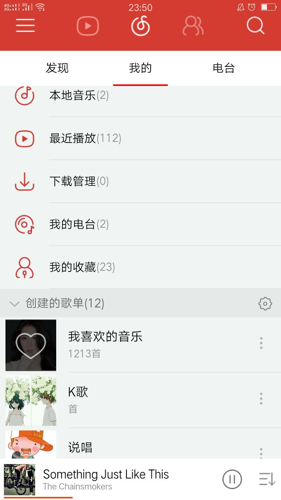
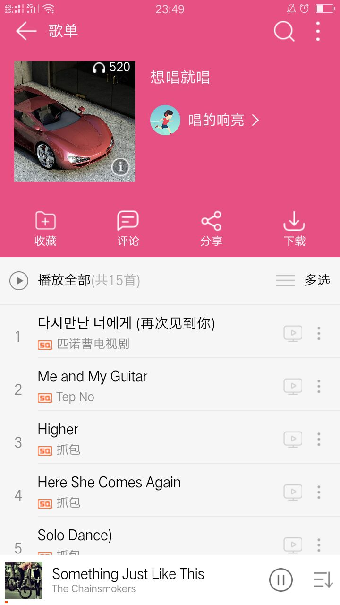
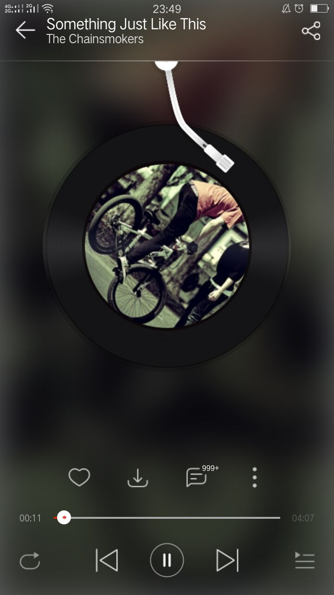
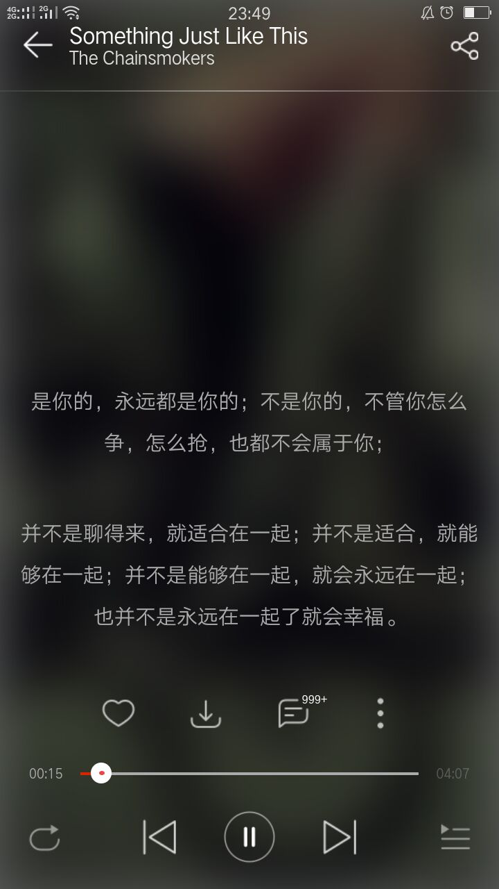
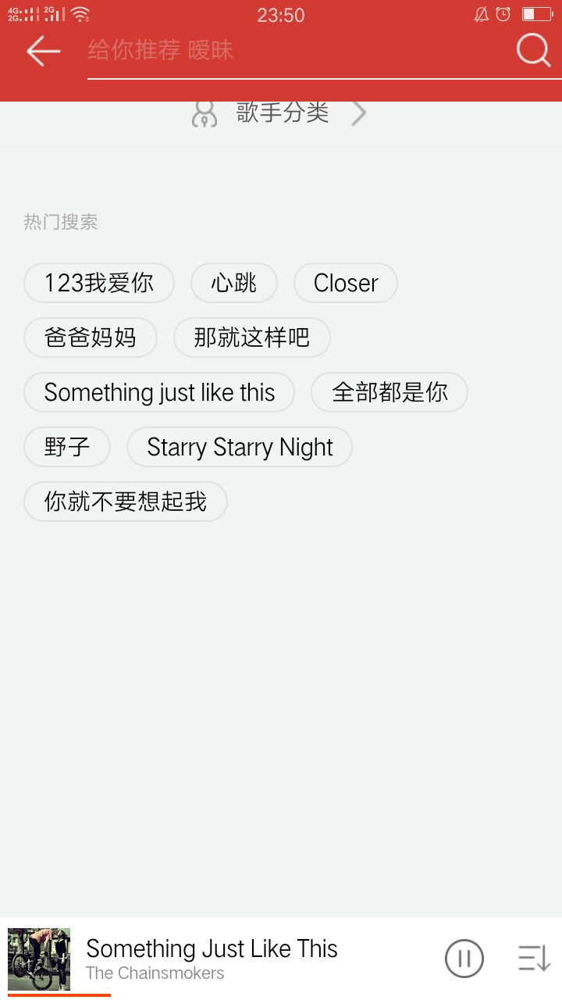

## 前言

此项目是本人现学现做的Web App,并不是想班门弄斧,就是记录一下自己的学习过程。

此外非常感谢我们小组成员， :princes: huangtaining美女的参与，是她帮助我完成了首页和评论页面的搭建

## 从中学到的框架

> * 视图框架：create-react-app、react、react-dom、react-router、react-router-dom
> * 状态管理：redux，histoy 、react-router-redux
> * css框架：node-sass sass-loder
> * dom框架：jquery
> * 发布：gh-pages

> 在开发前并不是直接使用的react脚手架，而是先自己尝试用webpack去打包项目，用到了webpack、webpack-cli、babel-react、babel-es2015、babel-react、babel-core,知道怎么去配置webpack.config.js和.babelrc，以及热更新插件，html模板插件等。但发现自己的配的webpack性能方面不及react脚手架，不过有一点好那就是可配置性比较高。

## 说说自己遇到的问题

>* 第一个问题就是页面适配的问题，最初想用rem去适配，但对那个单位的拿捏并不是很到位，索性就直接用px写了。写了第一个页面发现，在移动端适配性也不是很差，干脆就用px写完了。
>* 单页面写完后想加页面，发现跳转这一块还是个问题，之前没接触过路由这块的东西，只能一点点去学。然后把react-route 4 学了一遍。路由这一块遇到的最大的坑就是路由器的选择，因为我写的是纯静态页面，而我用了BrowseRouter，把项目发布的git后发现访问不了，查了很久的资料，原来有个路由器HashRouter是专为静态页面而生的。
>* 待更新

------
## 页面展示

### [应用链接](https://zealforyou.github.io/cloud-music/)

------

再一次感谢您花费时间阅读

作者 [@zhangzhuo]    
2018 年 06月 30日    